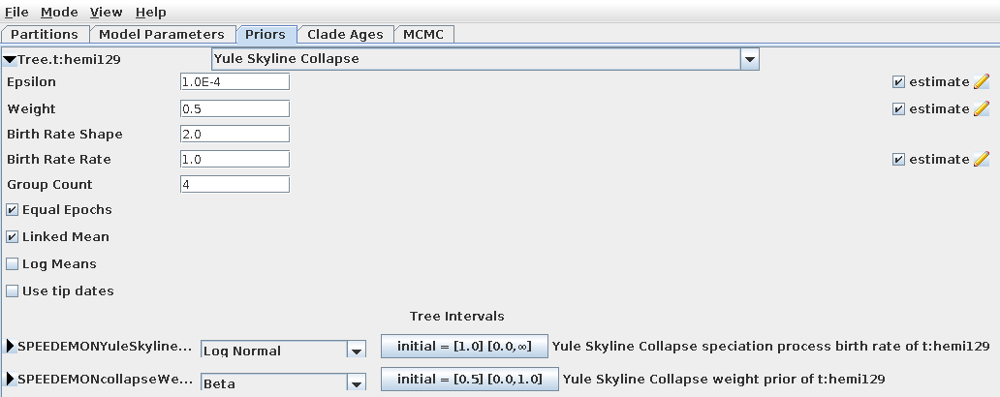

# SPEEDEMON - Species Delimitation

Species delimitation is the task of defining boundaries between species. 

SPEEDEMON is a BEAST 2 package for fast species delimitation under the multispecies coalescent. Inference can be done using multilocus sequence data (i.e. genes) using StarBeast3, or from single nucleotide polymorphism (SNP) data using SNAPPER.  Both StarBeast3 and SNAPPER are highly efficient at doing Bayesian inference under the multispecies coalescent. 

Species boundaries are applied under the tree collapse model, which acts as a prior distribution for the species tree. Under this model, samples whose ancestral species time falls below threshold epsilon are collapse into a single species. This is the same model used by STACEY. This model has been further extended to the Yule-skyline collapse model, so that the speciation rate varies through time as a smooth piecewise function (as presented in the BICEPS package).

This model describes how to prepare a BEAST 2 XML file specifying the Yule-skyline collapse model.

The main repository of SPEEDEMON is compatible with BEAST 2.7. With compatability with 2.6, please see the v2.6 branch.

## Preparing an XML file using BEAUti

1. Launch BEAUti

2. Click on File -> Manage Packages

3. Install SPEEDEMON

4. SPEEDEMON can be run on top of StarBeast3 or SNAPPER. This step depends on which data type you will be using

	#### If using Multilocus sequences (StarBeast3)
    Open the StarBeast3 template and configure your BEAUti session as described in the tutorial [here](https://github.com/rbouckaert/starbeast3)

	#### If using SNP data (SNAPPER)
   Open the SNAPPER template and configure your BEAUti session as described in the tutorial [here](https://github.com/BEAST2-Dev/beast-docs/releases/download/v1.0/snapper-delimitation-tutorial-2021.zip)

5. Before saving the xml template, open the 'Priors' tab and select the Yule Skyline Collapse model as the species tree prior. Two new prior distributions will appear: for the collapse weight and the birth rate *rate*. The threshold epsilon can also be adjusted here. The 'Group Count' is the number of epochs in the skyline. This can be set to 1 to attain the birth collapse model. The birth rate of the first epoch is drawn from a Gamma distribution with a shape of 'shape' and a rate of 'birth rate rate'.

The Yule Skyline model (without the species delimitation component) has been described [here](https://www.beast2.org/2022/06/01/yule-skyline-tree-prior.html).

## What the XML file looks like

The Yule-skyline collapse model is a tree prior distribution for the species tree. For example, a Yule model prior may look like this:

	<distribution   id="YuleModel.t:Species" 
					spec="beast.evolution.speciation.YuleModel"  
					tree="@Tree.t:Species" 
					birthDiffRate="@speciationRate.t:Species" />

and this is here replaced with the Yule-skyline collapse prior:

	<distribution   id="YuleSkylineCollapse.t:Species" 
					spec="speedemon.YuleSkylineCollapse"  
					tree="@Tree.t:Species" 
					epsilon="1.0E-4" 
					birthRateShape="2" 
					birthRateRate="@YuleSkylineCollapseBirthRateRate.t:Species" 
					weight="@collapseWeight.t:Species" 
					equalEpochs="true" 
					linkedMean="true"  
					groupCount="4" />

There are also MCMC operators and prior distributions for the two new parameters (``@YuleSkylineCollapseBirthRateRate.t:Species`` and ``@collapseWeight.t:Species``) if they are part of the state.

## Post-processing

The ``ClusterTreeSetAnalyser`` tool can be used to analyse the posterior distribution of species boundaries from a posterior distribution of species trees. This can be run as follows:

	/path/to/beast/bin/applauncher ClusterTreeSetAnalyser -trees species.tree -out species.txt -epsilon 1e-4 -burnin 10 

Epsilon should be the same value here that you used during the MCMC step.

As an example, we ran BEAST 2 on the gecko XML [example session](https://github.com/rbouckaert/speedemon/blob/master/examples/leache.xml) by Leaché et al. Some snippets from a resulting [ClusterTreeSetAnalyser  output file](https://github.com/rbouckaert/speedemon/blob/master/examples/leacheClusters.txt) are below.

This first block (below) specifies the species topologies found in the posterior distribution, as well as their posterior support. The rows are sorted by posterior support, and the set of topologies above the ``=== 95% credible set ===`` line comprise the 95% credible set.

	The 95 precent credible set consists of 27 out of 78 topologies

	support	#taxa	topology
	61.57%	3	((coal_CA1_2_S + coal_CA1_3_S + coal_CA1_4_S + coal_CA1_5_S + coal_CG_6_S + coal_GA_26_S,eng_EG_21_S + eng_EG_22_S + eng_EG_23_S + eng_EG_24_S + eng_EG_25_S + eng_NG_15_S + eng_NG_18_S + eng_NG_1_S),eng_CA2_20_S + fas_GH1_12_S + fas_GH1_13_S + fas_GH1_14_S + fas_GH2_10_S + fas_GH2_11_S + fas_GH2_16_S + fas_GH2_17_S + fas_GH4_32_S + fas_GH4_33_S + fas_GH4_34_S + fas_GH4_35_S + fas_GH4_36_S + fas_GH4_37_S + fas_GH4_38_S + fas_GH4_39_S + fas_GH4_40_S + kya_GH3_27_S + kya_GH3_28_S + kya_GH3_29_S + kya_GH3_30_S + kya_GH3_31_S + kya_GH3_41_S + kya_GH3_42_S + kya_GH3_43_S + kya_GH3_44_S + kya_GH3_45_S + kya_GH3_46_S + kya_GH3_47_S + kya_GH3_7_S + kya_GH3_8_S + kya_GH3_9_S)
	5.59%	4	(((coal_CA1_2_S + coal_CA1_3_S + coal_CA1_4_S + coal_CA1_5_S + coal_CG_6_S,coal_GA_26_S),eng_EG_21_S + eng_EG_22_S + eng_EG_23_S + eng_EG_24_S + eng_EG_25_S + eng_NG_15_S + eng_NG_18_S + eng_NG_1_S),eng_CA2_20_S + fas_GH1_12_S + fas_GH1_13_S + fas_GH1_14_S + fas_GH2_10_S + fas_GH2_11_S + fas_GH2_16_S + fas_GH2_17_S + fas_GH4_32_S + fas_GH4_33_S + fas_GH4_34_S + fas_GH4_35_S + fas_GH4_36_S + fas_GH4_37_S + fas_GH4_38_S + fas_GH4_39_S + fas_GH4_40_S + kya_GH3_27_S + kya_GH3_28_S + kya_GH3_29_S + kya_GH3_30_S + kya_GH3_31_S + kya_GH3_41_S + kya_GH3_42_S + kya_GH3_43_S + kya_GH3_44_S + kya_GH3_45_S + kya_GH3_46_S + kya_GH3_47_S + kya_GH3_7_S + kya_GH3_8_S + kya_GH3_9_S)
	4.11%	4	((coal_CA1_2_S + coal_CA1_3_S + coal_CA1_4_S + coal_CA1_5_S + coal_CG_6_S + coal_GA_26_S,(eng_EG_21_S + eng_EG_22_S + eng_EG_23_S + eng_EG_24_S + eng_EG_25_S,eng_NG_15_S + eng_NG_18_S + eng_NG_1_S)),eng_CA2_20_S + fas_GH1_12_S + fas_GH1_13_S + fas_GH1_14_S + fas_GH2_10_S + fas_GH2_11_S + fas_GH2_16_S + fas_GH2_17_S + fas_GH4_32_S + fas_GH4_33_S + fas_GH4_34_S + fas_GH4_35_S + fas_GH4_36_S + fas_GH4_37_S + fas_GH4_38_S + fas_GH4_39_S + fas_GH4_40_S + kya_GH3_27_S + kya_GH3_28_S + kya_GH3_29_S + kya_GH3_30_S + kya_GH3_31_S + kya_GH3_41_S + kya_GH3_42_S + kya_GH3_43_S + kya_GH3_44_S + kya_GH3_45_S + kya_GH3_46_S + kya_GH3_47_S + kya_GH3_7_S + kya_GH3_8_S + kya_GH3_9_S)
	...
	=== 95% credible set ===
	...
	0.23%	4	((coal_CA1_2_S + coal_CA1_3_S + coal_CA1_4_S + coal_CA1_5_S + coal_CG_6_S,(coal_GA_26_S,eng_EG_21_S + eng_EG_22_S + eng_EG_23_S + eng_EG_24_S + eng_EG_25_S + eng_NG_15_S + eng_NG_18_S + eng_NG_1_S)),eng_CA2_20_S + fas_GH1_12_S + fas_GH1_13_S + fas_GH1_14_S + fas_GH2_10_S + fas_GH2_11_S + fas_GH2_16_S + fas_GH2_17_S + fas_GH4_32_S + fas_GH4_33_S + fas_GH4_34_S + fas_GH4_35_S + fas_GH4_36_S + fas_GH4_37_S + fas_GH4_38_S + fas_GH4_39_S + fas_GH4_40_S + kya_GH3_27_S + kya_GH3_28_S + kya_GH3_29_S + kya_GH3_30_S + kya_GH3_31_S + kya_GH3_41_S + kya_GH3_42_S + kya_GH3_43_S + kya_GH3_44_S + kya_GH3_45_S + kya_GH3_46_S + kya_GH3_47_S + kya_GH3_7_S + kya_GH3_8_S + kya_GH3_9_S)
	0.16%	5	(((coal_CA1_2_S + coal_CA1_3_S + coal_CA1_4_S + coal_CA1_5_S + coal_CG_6_S + coal_GA_26_S,eng_NG_1_S),(eng_EG_21_S + eng_EG_22_S + eng_EG_23_S + eng_EG_24_S + eng_EG_25_S,eng_NG_15_S + eng_NG_18_S)),eng_CA2_20_S + fas_GH1_12_S + fas_GH1_13_S + fas_GH1_14_S + fas_GH2_10_S + fas_GH2_11_S + fas_GH2_16_S + fas_GH2_17_S + fas_GH4_32_S + fas_GH4_33_S + fas_GH4_34_S + fas_GH4_35_S + fas_GH4_36_S + fas_GH4_37_S + fas_GH4_38_S + fas_GH4_39_S + fas_GH4_40_S + kya_GH3_27_S + kya_GH3_28_S + kya_GH3_29_S + kya_GH3_30_S + kya_GH3_31_S + kya_GH3_41_S + kya_GH3_42_S + kya_GH3_43_S + kya_GH3_44_S + kya_GH3_45_S + kya_GH3_46_S + kya_GH3_47_S + kya_GH3_7_S + kya_GH3_8_S + kya_GH3_9_S)
	...

Second, the block below describes the joint posterior distribution of species assignments (as opposed to species topologies):

	support	#taxa	clusters
	61.57%	3	coal_CA1_2_S + coal_CA1_3_S + coal_CA1_4_S + coal_CA1_5_S + coal_CG_6_S + coal_GA_26_S,eng_CA2_20_S + fas_GH1_12_S + fas_GH1_13_S + fas_GH1_14_S + fas_GH2_10_S + fas_GH2_11_S + fas_GH2_16_S + fas_GH2_17_S + fas_GH4_32_S + fas_GH4_33_S + fas_GH4_34_S + fas_GH4_35_S + fas_GH4_36_S + fas_GH4_37_S + fas_GH4_38_S + fas_GH4_39_S + fas_GH4_40_S + kya_GH3_27_S + kya_GH3_28_S + kya_GH3_29_S + kya_GH3_30_S + kya_GH3_31_S + kya_GH3_41_S + kya_GH3_42_S + kya_GH3_43_S + kya_GH3_44_S + kya_GH3_45_S + kya_GH3_46_S + kya_GH3_47_S + kya_GH3_7_S + kya_GH3_8_S + kya_GH3_9_S,eng_EG_21_S + eng_EG_22_S + eng_EG_23_S + eng_EG_24_S + eng_EG_25_S + eng_NG_15_S + eng_NG_18_S + eng_NG_1_S
	6.13%	4	coal_CA1_2_S + coal_CA1_3_S + coal_CA1_4_S + coal_CA1_5_S + coal_CG_6_S,coal_GA_26_S,eng_CA2_20_S + fas_GH1_12_S + fas_GH1_13_S + fas_GH1_14_S + fas_GH2_10_S + fas_GH2_11_S + fas_GH2_16_S + fas_GH2_17_S + fas_GH4_32_S + fas_GH4_33_S + fas_GH4_34_S + fas_GH4_35_S + fas_GH4_36_S + fas_GH4_37_S + fas_GH4_38_S + fas_GH4_39_S + fas_GH4_40_S + kya_GH3_27_S + kya_GH3_28_S + kya_GH3_29_S + kya_GH3_30_S + kya_GH3_31_S + kya_GH3_41_S + kya_GH3_42_S + kya_GH3_43_S + kya_GH3_44_S + kya_GH3_45_S + kya_GH3_46_S + kya_GH3_47_S + kya_GH3_7_S + kya_GH3_8_S + kya_GH3_9_S,eng_EG_21_S + eng_EG_22_S + eng_EG_23_S + eng_EG_24_S + eng_EG_25_S + eng_NG_15_S + eng_NG_18_S + eng_NG_1_S
	4.27%	4	coal_CA1_2_S + coal_CA1_3_S + coal_CA1_4_S + coal_CA1_5_S + coal_CG_6_S + coal_GA_26_S,eng_CA2_20_S + fas_GH1_12_S + fas_GH1_13_S + fas_GH1_14_S + fas_GH2_10_S + fas_GH2_11_S + fas_GH2_16_S + fas_GH2_17_S + fas_GH4_32_S + fas_GH4_33_S + fas_GH4_34_S + fas_GH4_35_S + fas_GH4_36_S + fas_GH4_37_S + fas_GH4_38_S + fas_GH4_39_S + fas_GH4_40_S + kya_GH3_27_S + kya_GH3_28_S + kya_GH3_29_S + kya_GH3_30_S + kya_GH3_31_S + kya_GH3_41_S + kya_GH3_42_S + kya_GH3_43_S + kya_GH3_44_S + kya_GH3_45_S + kya_GH3_46_S + kya_GH3_47_S + kya_GH3_7_S + kya_GH3_8_S + kya_GH3_9_S,eng_EG_21_S + eng_EG_22_S + eng_EG_23_S + eng_EG_24_S + eng_EG_25_S,eng_NG_15_S + eng_NG_18_S + eng_NG_1_S
	...

Third, this block reports the marginal posterior probability of each cluster. There may be many instances of individuals being assigned to their own cluster, for example ``coal_GA_26_S`` is assigned to its own cluster with 12% posterior support in this example:

	support	count	cluster
	99.84%	1286	eng_CA2_20_S + fas_GH1_12_S + fas_GH1_13_S + fas_GH1_14_S + fas_GH2_10_S + fas_GH2_11_S + fas_GH2_16_S + fas_GH2_17_S + fas_GH4_32_S + fas_GH4_33_S + fas_GH4_34_S + fas_GH4_35_S + fas_GH4_36_S + fas_GH4_37_S + fas_GH4_38_S + fas_GH4_39_S + fas_GH4_40_S + kya_GH3_27_S + kya_GH3_28_S + kya_GH3_29_S + kya_GH3_30_S + kya_GH3_31_S + kya_GH3_41_S + kya_GH3_42_S + kya_GH3_43_S + kya_GH3_44_S + kya_GH3_45_S + kya_GH3_46_S + kya_GH3_47_S + kya_GH3_7_S + kya_GH3_8_S + kya_GH3_9_S
	79.89%	1029	coal_CA1_2_S + coal_CA1_3_S + coal_CA1_4_S + coal_CA1_5_S + coal_CG_6_S + coal_GA_26_S
	69.02%	889		eng_EG_21_S + eng_EG_22_S + eng_EG_23_S + eng_EG_24_S + eng_EG_25_S + eng_NG_15_S + eng_NG_18_S + eng_NG_1_S
	14.98%	193		coal_CA1_2_S + coal_CA1_3_S + coal_CA1_4_S + coal_CA1_5_S + coal_CG_6_S
	11.96%	154		coal_GA_26_S
	...

Finally, the posterior support that every (observed) pairwise combination of individuals are in the same species:

	support	count	pair
	100%	1288	kya_GH3_29_S + kya_GH3_9_S
	100%	1288	fas_GH1_12_S + kya_GH3_47_S
	100%	1288	fas_GH1_14_S + kya_GH3_43_S 
	...

## Supplementary data

Supplementary data for SPEEDEMON can be found at [https://github.com/jordandouglas/speedemon_SI](https://github.com/jordandouglas/speedemon_SI).

## References

**SPEEDEMON** Jordan Douglas and Remco Bouckaert. Quantitatively defining species boundaries with more efficiency and more biological realism. Communications Biology 5, 755 (2022). 

**StarBeast3:** Douglas, Jordan, Cinthy L. Jiménez-Silva, and Remco Bouckaert. "StarBeast3: Adaptive Parallelized Bayesian Inference under the Multispecies Coalescent." Systematic Biology (2022).

**SNAPPER:** Stoltz, Marnus, et al. "Bayesian inference of species trees using diffusion models." _Systematic Biology_ 70.1 (2021): 145-161.

**STACEY:** Jones, Graham. "Algorithmic improvements to species delimitation and phylogeny estimation under the multispecies coalescent." _Journal of mathematical biology_ 74.1-2 (2017): 447-467.

**BICEPS:** Bouckaert, Remco R. "An efficient coalescent epoch model for Bayesian phylogenetic inference." Systematic Biology (2022): syac015. 

**Gecko dataset:** Leaché, Adam D., et al. "Species delimitation using genome-wide SNP data." Systematic biology 63.4 (2014): 534-542.

