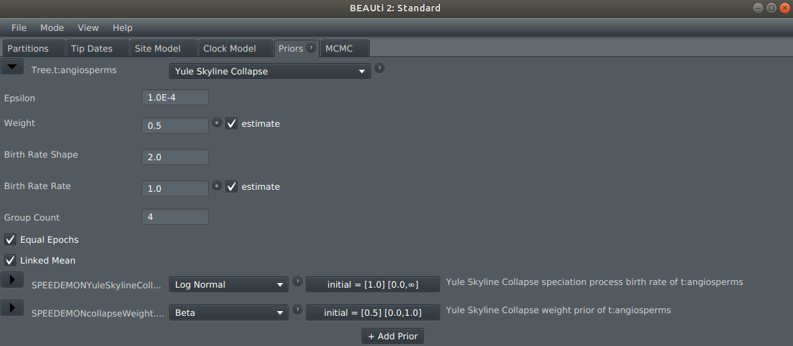

# SPEEDEMON - Species Delimitation

Species delimitation is the task of defining boundaries between species. 

SPEEDEMON is a BEAST 2 package for fast species delimitation under the multispecies coalescent. Inference can be done using multilocus sequence data (i.e. genes) using StarBeast3, or from single nucleotide polymorphism (SNP) data using SNAPPER.  Both StarBeast3 and SNAPPER are highly efficient at doing Bayesian inference under the multispecies coalescent. 

Species boundaries are applied under the tree collapse model, which acts as a prior distribution for the species tree. Under this model, samples whose ancestral species time falls below threshold epsilon are collapse into a single species. This is the same model used by STACEY.

## Preparing an xml file using BEAUti

1. Launch BEAUti
2. Click on File -> Manage Packages
3. Install SPEEDEMON

If SPEEDEMON is not in the list of packages, you may need to add an extra package repository as follows:

* click the `packager repositories` button. A dialog pops up.
* click the `Add URL` button. A dialog is shown where you can enter `https://raw.githubusercontent.com/CompEvol/CBAN/master/packages-extra.xml`
* click the `OK` button. There should be an extra entry in the list.
* click `Done`
* After a short delay, the SPEEDEMON package should appear in the list of packages.

4. SPEEDEMON can be run on top of StarBeast3 or SNAPPER. This step depend on which data type you will be using

	#### If using Multilocus sequences (StarBeast3)
    Open the StarBeast3 template and configure your beauti session as described [here](https://github.com/rbouckaert/starbeast3)

	#### IF using SNP data (SNAPPER)
    TODO

5. Before saving the xml template, open the 'Priors' tab and select the Yule Skyline Collapse model as the species tree prior. Two new prior distributions will appear: for the collapse weight and the birth rate *rate*. The threshold epsilon can also be adjusted here.

## Preparing an xml file by hand

## Post-processing

## References

**StarBeast3:** Douglas, Jordan, Cinthy Jimenez-Silva, and Remco Bouckaert. "StarBeast3: Adaptive Parallelised Bayesian Inference of the Multispecies Coalescent." _bioRxiv_ (2021).

**SNAPPER:** Stoltz, Marnus, et al. "Bayesian inference of species trees using diffusion models." _Systematic Biology_ 70.1 (2021): 145-161.

**STACEY:** Jones, Graham. "Algorithmic improvements to species delimitation and phylogeny estimation under the multispecies coalescent." _Journal of mathematical biology_ 74.1-2 (2017): 447-467.