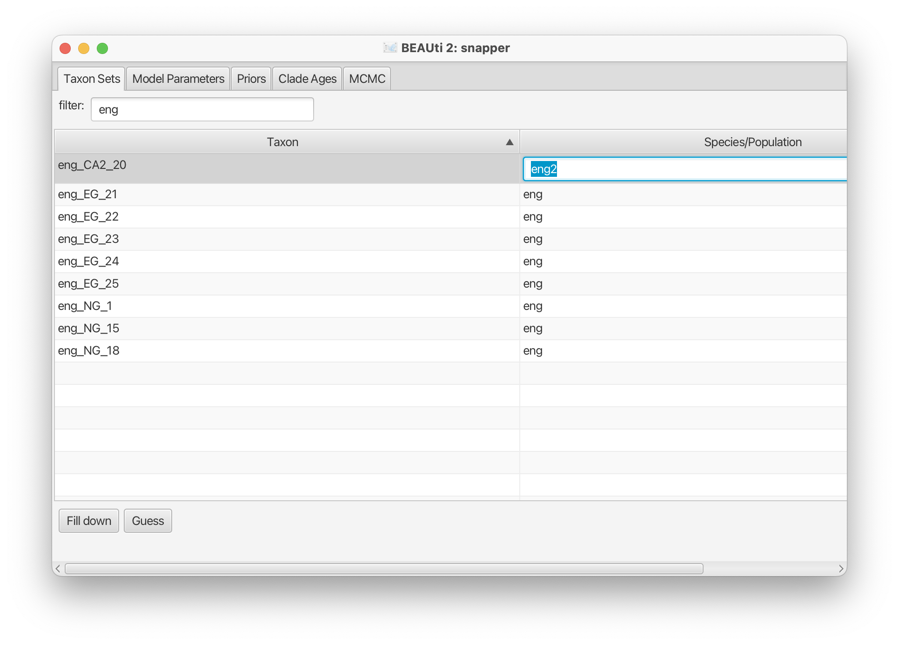

# Speedemon tutorial: Species delimitation with SNP data

# Background

Species delimitation based on multi species coalescent model can be done relatively quickly in a full Bayesian setting using a tree prior that collapses species in the same group when they are genetically indistinguishable.
In this tutorial, we will use a SNP alignment of East African geckos from the *Hemidactylus fasciatus* species complex (Leaché et al, 2014).

We will use a multi-species coalescent model that integrates out the gene trees (Stolz, et al, 2021) to infer species trees.

To identify species, we use a collapse model that groups and ungroups taxa during the MCMC run (Douglas & Bouckaert, 2022), depending on how genetically close the species are.


----

# Programs used in this Exercise

### BEAST2 - Bayesian Evolutionary Analysis Sampling Trees 2

BEAST2 is a free software package for Bayesian evolutionary analysis of molecular sequences using MCMC and strictly oriented toward inference using rooted, time-measured phylogenetic trees (Bouckaert et al, 2019). This tutorial uses the BEAST2 version 2.7.6.

### BEAUti2 - Bayesian Evolutionary Analysis Utility

BEAUti2 is a graphical user interface tool for generating BEAST2 XML configuration files.

Both BEAST2 and BEAUti2 are Java programs, which means that the exact same code runs on all platforms. For us it simply means that the interface will be the same on all platforms. The screenshots used in this tutorial are taken on a Mac OS X computer; however, both programs will have the same layout and functionality on both Windows and Linux. BEAUti2 is provided as a part of the BEAST2 package so you do not need to install it separately.

### Tracer

Tracer is used to summarise the posterior estimates of the various parameters sampled by the Markov Chain. This program can be used for visual inspection and to assess convergence. It helps to quickly view median estimates and 95% highest posterior density intervals of the parameters, and calculates the effective sample sizes (ESS) of parameters. It can also be used to investigate potential parameter correlations. We will be using Tracer v1.7.2.

----

# Practical: Species delimitation of East African geckos

We will set up an analysis in BEAUti using the snapper package and set up a multi Yule collapse model from the speedemon package. First, we will install these packages:

> * Start BEAUti
> * Click to the `File => Manage packages` menu item.
> * Select `snapper` in the list of packages and the click `Install` button.
> * Select `speedemon` in the list of packages and the click `Install` button.
> * Close BEAUti -- it needs to restart to pick up the new packages.


## Set up in BEAUti

Before you begin, download the alignment from [here](https://raw.githubusercontent.com/BEAST2-Dev/SNAPP/master/examples/nexus/hemi129.nex).

> Start BEAUti and select the `File => Templates => snapper` item

BEAUti should change to show it uses the snapper template.


	<figcaption>Figure 1: Select the snapper template, and BEAUti changes its appearance.</figcaption>

> Select `File => Add alignment`, and choose the file `hemi129.nex` you just downloaded.

The partition panel now shows one entry per taxon, and a mapping to species. 


	<figcaption>Figure 2: After loading an alignment, BEAUti attemtps to automatically map taxa to species.</figcaption>

By default, species are assigned to taxa through some heuristic based on the taxon name.
If you click the `Guess` button, a dialog pops up where you can formulate various rules to specify the species based on the taxon name. For example, if you click `OK` when `use everything` is selected and `after first` with the underscore as character to separate on, it puts every taxon in its own species for this analysis.


	<figcaption>Figure 3: There are many ways to help in mapping taxa to species based on the taxon name. This includes specifying the mapping in a text file, where the file uses one line per taxon, and the first word is the taxon name followed by a tab (not space!) followed by the species name. Here, we use the defaults.</figcaption>

Here, we have some suspicion that the taxon labelled `eng_CA2_20` may not be an `eng` species.

> Search for the `eng` taxa by typing `eng` in the search box.
> Double click the entry next to `eng_CA2_20` and add a 2, so the species is labelled `eng2`.
> Don't forget to press `return` to confirm the edit.


	<figcaption>Figure 4: Editing the species assignment.</figcaption>


> Switch to the `Model parameters` tab.


	<figcaption>Figure 5: Various model parameters that can be changed.</figcaption>

The following can be changed:
* Coalescent rate: starting values of the coalescent rates and whether they should be estimated (recommended) or stay fixed (only use when prior information is available).
* N: dimension of Chebyshef functions used, should be power of 2 plus 1. Higher values are more accurate but slower (optional, default: 33)
* non-polymorphic: Check box if there was no pre-filtering of sites to remove all constant sites. Leave unchecked if constant sites had been removed or systematically not selected (e.g. SNP data). The likelihoods will be adjusted according. (optional, default: true)
* number of sites which were not filtered to remove constant sites: Number of sites not pre-filtered.  (default =0). This setting ignored unless non-polymorphic set to TRUE (optional, default: 0)
* mutation Only At Root: Emulate the likelihood calculation of RoyChoudhury et al (2008) which assumes that mutations occur only in the ancestral (root) population (optional, default: false). Should almost certainly be left unchecked.
* use Log Likelihood Correction: use correction of log likelihood for the purpose of calculating Bayes factors for different species assignments. There is (almost) no computational cost involved for the MCMC chain, but the log likelihood might be reported as positive number with this correction since the likelihood is not a proper likelihood any more. (optional, default: true)
* use Beta Root Prior: instead of using a uniform prior for allele frequencies at the root, use a beta root prior (optional, default: false)

> Leave all values as is, and switch to the `Priors` tab

> Change the Tree prior to `Yule Skyline Collapse`

> Click the triangle next toe `Yule Skyline Collapse` to show its options


	<figcaption>Figure 6: Priors panel.</figcaption>


The Yule Skyline Collapse is a mixture of skyline version of Yule tree prior that integrates out birth rate parameters under a gamma prior and spike distribution on internal node heights. It has the following options:

* epsilon: collapse height value below wich taxa are considered to be the same species. It may be useful to run the analysis with different values to see how sensitive the species assignments are under different settings. See section `User guide for selecting threshold &epsilon;` of Douglas & Bouckaert, 2022 on how to set epsilon.
* weight: mixture weight between Yule and spike density. Can be estimated (recommended).
* birth Rate Shape: Shape of the gamma prior distribution on birth rates. A value of 2 is default and is used in the literature.
* birth Rate Rate: Rate of the gamma prior distribution on birth rates. Can be estimated (recommended).
* group Count: the number of groups used, which determines the dimension of the groupSizes parameter. If less than zero (default) 10 groups will be used, unless group sizes are larger than 30 (then group count = number of taxa/30) or less than 6 (then group count = number of taxa/6 (optional, default: -1)
* equal Epochs: if equalEpochs is false, use epochs based on groups from tree intervals, otherwise use equal sized epochs that scale with the tree height (optional, default: false)
* linked Mean: use populationMean only for first epoch, and for other epochs use the posterior mean of the previous epoch (optional, default: false)


Note that at the bottom of the screen is a button to `+ Add priors`. This allows adding monophyletic constraints and other priors.

> Leave all values as is, and switch to the `MCMC` tab. Change chain length to 1 million.


	<figcaption>Figure 7: MCMC settings.</figcaption>


> Select the mena `View => Show Operators panel`. A new panel appears with information of the MCMC operators. 


	<figcaption>Figure 8: Make operators tab visible.</figcaption>

> Change the weight of the `Gamma Mover` and `Rate Mixer` operator to `10`. 


	<figcaption>Figure 9: Change weights of gamma mover and rate mixer operators to 10.</figcaption>

This causes the operators on rates to be selected more often. Without increasing the weights this analysis will mix rather slow, since coalescent rates are not updated often enough.

> Save the file to XML, say `speedemon.xml`. A copy of the file can be found [here](https://github.com/rbouckaert/speedemon/releases/download/publish/speedemon.xml).

```
Topic for discussion: There is no tab for clock models, so a relaxed clock cannot 
be set up in BEAUti.
Why would a relaxed clock not be a good idea in combination with the snapper multi 
species coalescent?
```


```
Topic for discussion: here, we changed the weights of operators deviating from 
the defaults.
How would you know when and which operators to change in general?
```
<!-- relaxed clocks branch rates, branch lengths and coalescent rates are interchangable, leading to unidentifiability -->

----

## Running BEAST

Unfortunately, running this analysis will take too long...
We will use the pre-cooked log files.

> Download [speedemon.log](https://github.com/rbouckaert/speedemon/releases/download/publish/speedemon.log) and [speedemon.trees](https://github.com/rbouckaert/speedemon/releases/download/publish/speedemon.trees) for post-processing.

```
Topic for discussion: running for a day is obviously too long for a tutorial.
How long is too long for a real world analysis?
```
<!-- since rerunning is almost always required, a month is the upper limit in practice -->


Snapper can benefit from using threads, and it depends a bit on the computer, the data, number of taxa, etc. 
In general, increasing taxa improves performance, however, since every thread has some overhead, using too many taxa may reduce performance.
It is not possible beforehand to predict how many threads is optimal, so you have to experiment with your data in order to find out the sweet spot where the number of threads is optimal for your analysis.


```
Topic for discussion: what would be the effect of putting every taxon in its 
own species and let the analysis decide which taxa group together?
```
<!-- more power to detect anomalies, takes a lot longer, may lead to convergence issues -->


```
Topic for discussion: the long runtime does not seem an improvement on running 
a fixed small number of hypotheses and estimating the marginal likelihoods for 
each of them.
Are there benefits/disadvantages of this approach over the collapse model 
(hint look at taxon `eng_CA2_20` in the results).
```

<!-- many more hypotheses are tested, not just a limited number of fixed hypotheses 
-->

----

## Analysing results


### Checking convergence

> Start `Tracer`, load `speedemon.log` via the `File => Import trace file` menu, or by drag/dropping the file in the trace filea table. Observe the results.


	<figcaption>Figure 10: Trace of cluster count.</figcaption>

All ESSs look good, except for those of some coalescent rates. 
This is because this is a combined log file of several other log files.
The coalescent rates for the 5 taxa are numbered 1 to 5, and the one at the root is 9, but for the internal nodes there is no fixed numbering, so different runs can have different numberings.
Combining these logs is fine if you are not interested in the coalescent rates/population sizes of internal branches.


### Visualise results 

> Start `DensiTree`, load `speedemon.trees` via the `File => Load` menu.


	<figcaption>Figure 11: DensiTree of gecko analysis.</figcaption>

It is already obvious that taxon `eng_CA2_20` is not part of the rest of the `eng` taxa.
It is not yet obvious whether it is part of the `kya` species, and/or whether `kya` and `fas` form a single species.
For this, we use the `ClusterTreeSetAnalyser` app that comes with the `speedemon` package.
	
### Testing species hypotheses
	
> Start `AppLauncher` -- this can be done in BEAUti using the `File => Launch Apps` menu.
> Select `speedemon` in the drop-down box at the top and select `ClusterTreeSetAnalyser`

<figure>
	<a id="fig:applauncher"></a>
	
 
	<figcaption>Figure 13: BEAST application launcher.</figcaption>
</figure>

> Click the `Launch` button, and a window pops up with the `ClusterTreeSetAnalyser`
> Click the `browse` button next to `Trees`, and select `speedemon.trees`.
> Set `Burnin` to zero (since this is a combined log, no need to take away burn-in).
> Set `Epsilon` to `1e-4`. This should be the same as used in the analysis set up in BEAUti.


	<figcaption>Figure 14: Cluster Tree Set Analyser.</figcaption>

> Click the `OK` button. The results should appear in the terminal window.


	<figcaption>Figure 15: Cluster Tree Set Analyser output.</figcaption>


Ignore the error messages at the top of the output (if any).


Note that an alternative to run the ClusterTreeSetAnalyser from the GUI is to run it from a terminal: go to the directory containing `speedemon.trees` and run 

`/path/to/applauncher ClusterTreeSetAnalyser -trees speedemon.trees -epsilon 1e-4 -b 0`

where `/path/to` the path to the place where applauncher is installed (typically `/Application/BEAST\ v2.7.5/bin` for OS X, `~/beast` on Linux and `\Program Files\BEAST\bat\` for Windows). 
The same output as above will be shown as above, but without having to point and click too much.


```
Topic for discussion: How many species are there?

Did the eng2 species go where you expected? What could be the reason?
```


----

# Useful Links

- BEAST 2 website and documentation: [http://www.beast2.org/](http://www.beast2.org/)
- [Bayesian Evolutionary Analysis with BEAST 2](http://www.beast2.org/book.html) (Drummond & Bouckaert, 2015)
- Join the BEAST user discussion: [http://groups.google.com/group/beast-users](http://groups.google.com/group/beast-users)

----

# Relevant References

Bouckaert R, Vaughan TG, Barido-Sottani J, Duchêne S, Fourment M, Gavryushkina A, Heled J, Jones G, Kühnert D, De Maio N, Matschiner M. BEAST 2.5: An advanced software platform for Bayesian evolutionary analysis. PLoS computational biology. 2019 Apr 8;15(4):e1006650.

Douglas J, Bouckaert R. Quantitatively defining species boundaries with more efficiency and more biological realism. Communications Biology. 2022 Jul 28;5(1):755.

Drummond AJ, Bouckaert RR. Bayesian evolutionary analysis with BEAST. Cambridge University Press; 2015.

Leaché, A. D., M. K. Fujita, V. N. Minin, and R. Bouckaert. 2014. Species delimitation using genome-wide SNP data. Systematic Biology 63:534–542.

Stoltz M, Baeumer B, Bouckaert R, Fox C, Hiscott G, Bryant D. Bayesian inference of species trees using diffusion models. Systematic Biology. 2021 Jan;70(1):145-61.